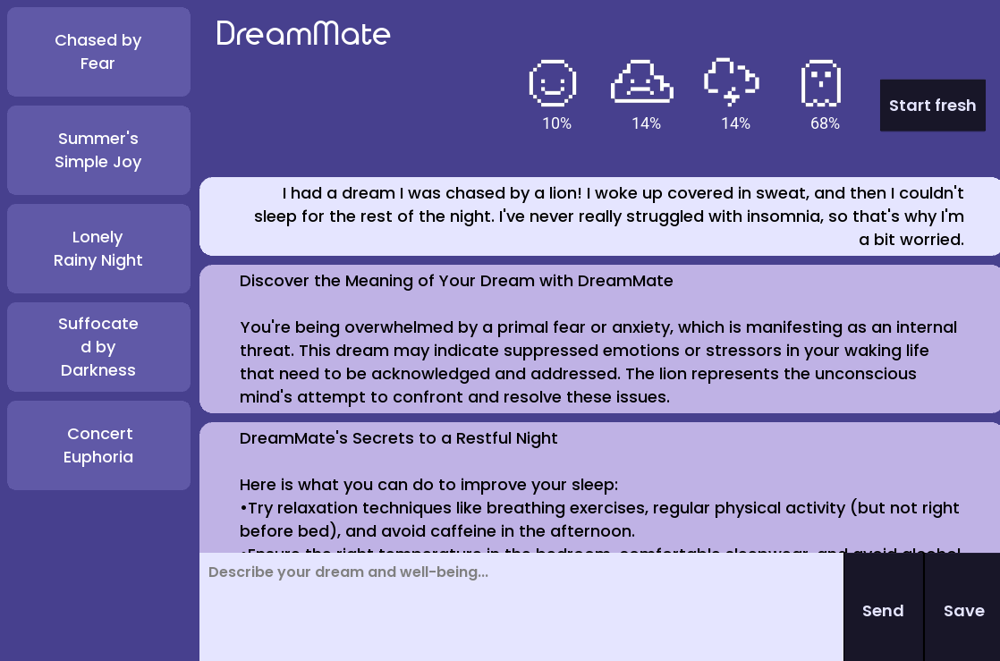

# DreamMate
##### [15.01.2025]
##### DreamMate is a Python project developed for an NLP class during the Winter Semester of 2024/2025.

DreamMate is your personal dream companion, designed for those who struggle with sleep and want to better understand their dreams.
Our solution not only helps you interpret your dreams but also provides insights into improving your sleep habits. DreamMate is here to be your trusted sleep companion!

## Features

### 🌙 Dream Interpretation
Enter your dream, and DreamMate will analyze it using symbolism, psychology, and medical knowledge to uncover its hidden meanings.

### 🛌 Sleep Habit Recommendations
Describe how you felt before and after sleep, and DreamMate will provide personalized tips to help you improve your sleep quality.

### 😃 Emotion Detection in Dreams
DreamMate will analyze your dream and detect emotions such as sadness, joy, anger, and fear. We use a custom-trained model based on dreams from DreamBank.net, as well as the j-hartmann Emotion English DistilRoBERTa-base model.

### 📖 Dream Journal
Save your dream conversations in a journal to track how your dreams and well-being evolve over time.

### 🎭 Dream Name Generator
DreamMate can generate creative and unique names for your dreams, making it easier to recall and categorize them.

## Authors

* Julia Kuczyńska

* Tymon Pluciński
